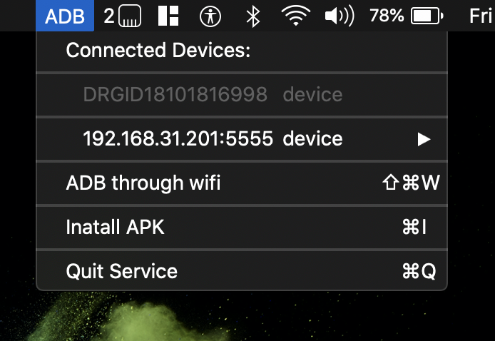

# ADB connect

ADB connect is a mac ( OSX ) application that will help u debug your android device in mac over the wifi using the adb connect script. 

### Prerequisite

To connect u device through wifi, 
 - Initially connect your phone to your mac via USB  ( USB debugging in phone must be ON )
 - Make sure both your devices are in same network
 - Select `ADB through wifi `option from the menu. thats it. u must see your phones IP address listed under connecred devices in the menu. 

Now u can disconnect USB device from your phone and continue over wifi

